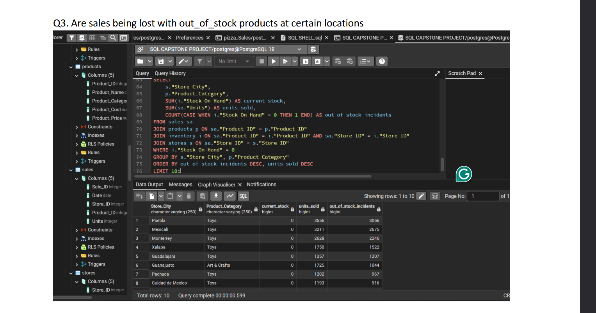

# Maven Toys Sales & Inventory SQL Analysis

## 📌 Project Overview
This repository contains a relational database capstone project analyzing sales and inventory metrics for **Maven Toys**, a toy store chain in Mexico. Using **PostgreSQL**, the objective was to write structured database queries to uncover critical business insights regarding product profitability, inventory valuation, and stockout impacts for the management team.

## 📊 Core Business Questions & Insights

### Q1: What are the business's profit drivers? Is this the same across store locations?
* **Top Profit Categories:** **Toys** is the absolute highest total profit driver overall ($1,079,527.00), followed closely by **Electronics** ($1,001,437.00). However, **Electronics** has a much higher margin efficiency of **44.6%** compared to Toys at **21.2%**.
* **Store Location Variations:** Drivers change by city market. For example, **Electronics** dominates profits in **Aguascalientes** ($19,619.00), while **Toys** takes the lead in **Campeche** ($34,152.00).

#### 💻 Query Code Snapshot

### Q2: How much money is tied up in inventory at the toy stores?
* **Highest Capital Investment:** The most capital is tied up in the **Toys** category with an inventory value of **$99,861.47** (7,553 units on hand), representing the highest stock risk for the business.
* **Lowest Capital Investment:** **Electronics** holds the lowest amount of tied-up cash at **$30,705.82** (2,418 units on hand).

### Q3: Are sales being lost with out-of-stock products at certain locations?
* **Critical Revenue Leaks:** Yes, significant sales volume is actively being lost. The **Toys** category is suffering massive stockout incidents across multiple major cities, most notably in **Puebla** and **Mexicali** while sitting at 0 inventory.

---

## 🛠️ Technical SQL Skills Demonstrated
* **Relational Joins:** Connecting products, stores, inventory levels, and transaction tables (`INNER JOIN`, `LEFT JOIN`).
* **Data Aggregation & Grouping:** Using `SUM()`, `COUNT()`, `AVG()`, and `GROUP BY` to structure metrics by store and category.

## 📂 Project Materials
* **Analysis Report:** Detailed query scripts, code execution snapshots, and data interpretations are fully documented in the uploaded project PDF file.
*
